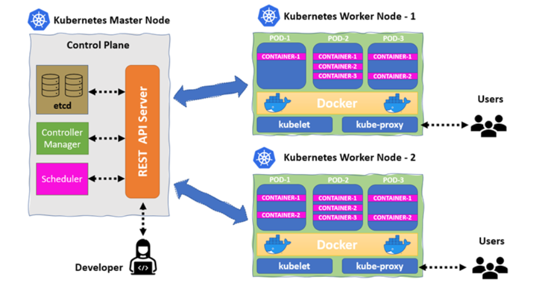
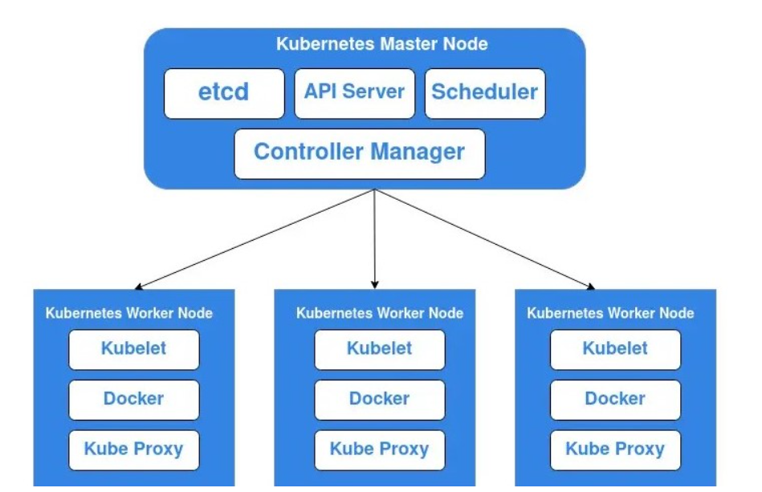
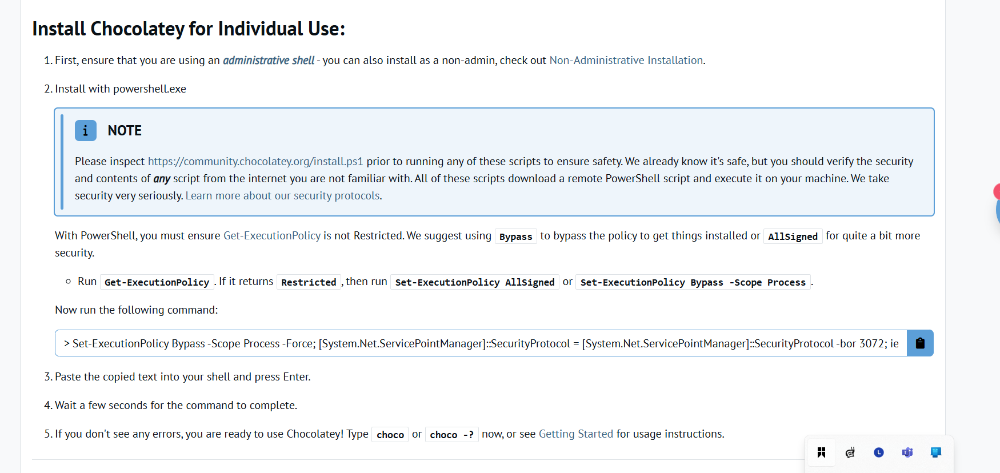
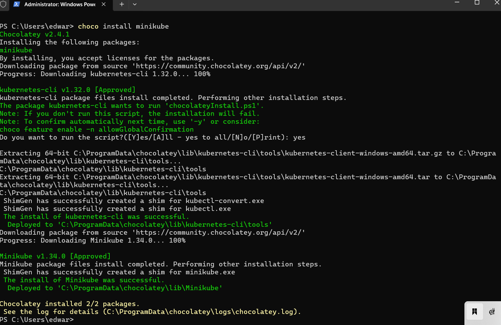
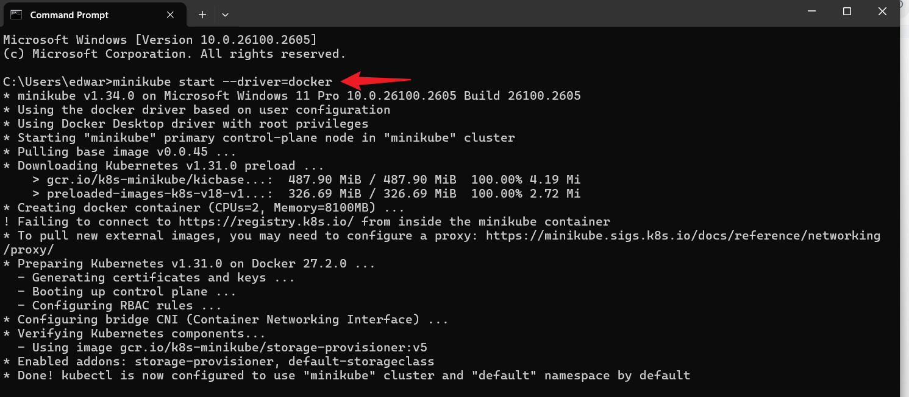

-# Setting Up Minikube@:'
## Container Orchestration With Kubernetes (K8s)

Container Orchestration with Kubernetes

Kubernetes is an open-source container orchestration platform that automates the deployment, scaling, and management of containerized applications. It simplifies the handling of complex container environments, ensuring applications run smoothly and efficiently.

Key Features:

Automated Deployment: Simplifies application deployment across diverse environments.

Scalability: Easily scales applications up or down based on demand.

Load Balancing: Efficiently distributes network traffic across containers.

Self-Healing: Automatically detects and replaces failed containers.

Service Discovery: Manages inter-container communication and load distribution.

Storage Orchestration: Manages storage resources for containers.

Secret Management: Securely stores and manages sensitive information and configurations.

## Components of KUBERNETES Cluster.

 

**Control Plane or Master Node**:  The control plane often refered to as the Master Node is the brain of the K8s cluster.It manages the entire cluster.It consists of components like the API server, etcd (key-value store), controller manager, and scheduler. These components work together to handle tasks such as scheduling containers, maintaining cluster state, and managing node health.

**Nodes**: Nodes are the worker machines in a Kubernetes cluster. They run containerized applications and provide the necessary resources. Each node contains essential components like the kubelet (for managing containers), a container runtime (eg Docker), and a kube-proxy (for networking).

**Pods**: Pods are the smallest and simplest Kubernetes objects. They represent a single instance of a running process in your cluster. A pod can contain one or more containers that share the same network namespace, storage, and resources. Pods are created and managed by Kubernetes to ensure your applications are running efficiently and reliably

**Containers** : Containers in kubernetes encapsulates and packages application along with their dependencies and runtime environment ensuring consistencies across various computing environment.Leveraging containeriztion technology such as Docker,container provide a lightweight, portable, and efficient way to deploy and run applications.In kubernetes,containers are organised into pods,the smallest deployable unit.

 

**API SERVER** : The API SERVER is the control plane component in kubernetes that serves as the front end for the kubernetes control plane.It exposes the kubernetes API,allowing users, other components,and external entities to interact with the cluster,managing resources and initiating various actions.

**Controller Manager** : The Controller Manager is the control plane component in kubernetes responsible for maintaining the desired state of the cluster.It includes various controllers that watch the state of the cluster through the API server and takes corrective actions to ensure that the actual state aligns with the desired state.

**Scheduler** : The Kubernetes Scheduler is a core component of the control plane. It determines which node an unscheduled pod will run on based on resource availability, constraints, and policies. The scheduler ensures optimal distribution of workloads across the cluster, balancing resource utilization and adhering to any specified requirements.

**etcd** etcd is a distributed, reliable key-value store that Kubernetes uses for configuration data, service discovery, and state management. It stores the entire state of the cluster and ensures data consistency across the system. etcd is critical for maintaining the cluster's desired state and enabling the Kubernetes control plane to operate effectively.

**kubelet** etcd is a distributed, reliable key-value store that Kubernetes uses for configuration data, service discovery, and state management. It stores the entire state of the cluster and ensures data consistency across the system. etcd is critical for maintaining the cluster's desired state and enabling the Kubernetes control plane to operate effectively.

**kube Proxy** Kube-proxy is a network proxy that runs on each node in a Kubernetes cluster. It maintains network rules for Pods, enabling communication within the cluster. Kube-proxy manages IP address and port forwarding, ensuring that network traffic reaches the correct Pods across the cluster.

## Project Goals

By the end of this project,we should have

1 Gained a comprehensive understanding of kubernetes and its fundamental concept.

2 Master the usage of Minikube for local Kubernetes cluster deployment and experimentation.

3 Acquired hands-on experience with Docker, understanding containerization principles and how to create,manage and distribute containerized applications.

4 Build and deploy application on Minikube.

## MiniKube

Minikube is an open source tool that enables us to run kubernetes clusters locally on our machines.As we now know that kubernetes is a container orchestration platform that automates the deployment,scaling and management of containeraized applications.Minikube streamlines the creation of a local kubernetes environment, providing a user-friendly playground where you can safely build and test applications before deploying to a production setting.

### Getting started with Minikube

To install minikube on windows, you need to install    `chocolatey`.Chocolatey is a windows package manager for installing,updating and removing software packages on window.

follow the instuction on the snippet to install chocolatey

Proceed to Installing Minikube by following these steps

* Go to the windows search bar and launch a terminal with administrative access

* Install Minikube

        choco install minikube

    

* Minikube needs a Docker as a driver and also pull its base image, therefore,we need to install Docker desktop for window.
 After installing docker Desktop,

* Run the command below to start minikube using docker as the driver
    
        minikube start --driver=docker

    

